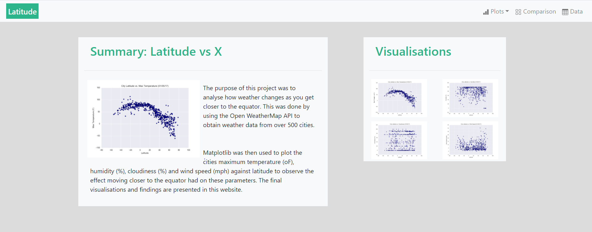
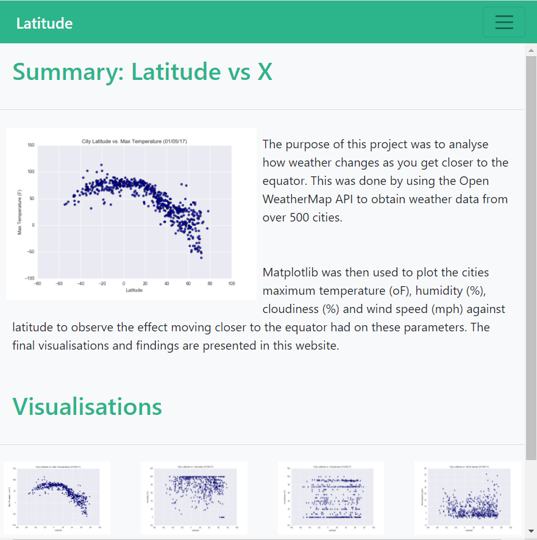
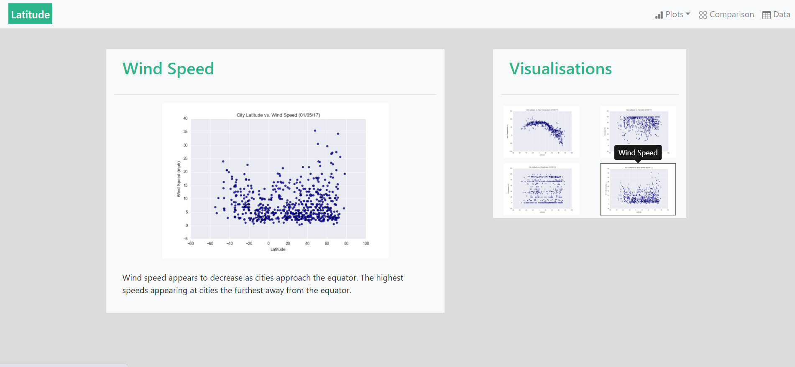
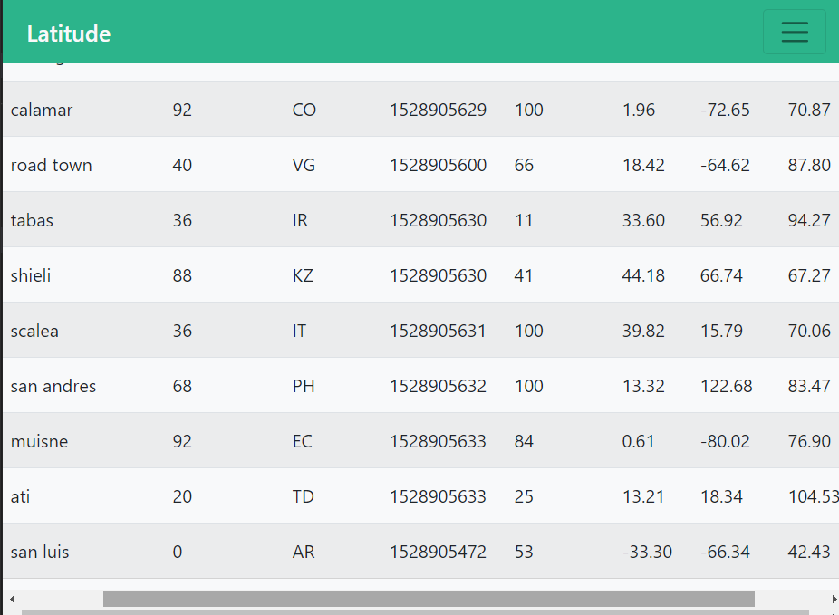
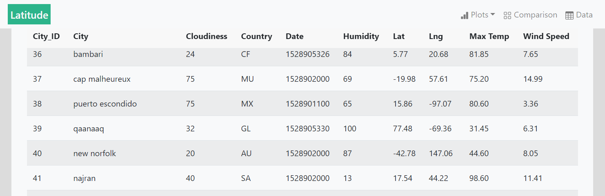

# Web-Design-Challenge
## Introduction

This is my submission for the Web Design Challenge Homework.


## Structure
```
|_WebVisualisations
	|_Resources
		|_assets
			|_images

				|_Fig1.png
				|_Fig2.png
				|_Fig3.png
				|_Fig4.png
	|_cities.csv
	|_cloud.html
	|_comparison.html
	|_df.html
	|_humidity.html
	|_index.html
	|_main.py
	|_style.css
	|_temp.html
	|_wind.html
|_.gitignore
|_README.md
|_Capture1.png
|_Capture2.png
|_Capture3.png
|_Capture4.png
|_Capture5.png
|_Capture6.png
|_Capture7.png


```


## Usage

```

#main.py to convert cities.csv into html table requires:
python 3.8.5
pandas 1.2.4

#The pages were created using:
HTML5
CSS W3
Bootstrap 4.3.1


```


## Summary

The completed dashboard can be viewed here: https://fernb.github.io/Web-Design-Challenge/WebVisualisations/index.html

A total of 7 pages were produced, the below chart outlines the structure:

<br>


 
<br>

Pages and content are responsive, some example screenshots are shown below.

<br>

Landing Page:

<br>


 
<br>

Landing Page on small screen:

<br>


 
<br>

Example plot page with active page highlighted with blue border and tooltips on navigation thumbnails:

<br>


 
<br>

Table is responsive on small screen and on large screen table header is sticky:

<br>


 
<br>

<br>


 
<br>
